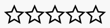
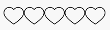
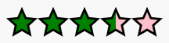

# react-rating-system
A star rating component fully customizable made with React !

## Demo

**[Check out the demo]** 








## Install

```
npm install react-rating-system
```

## Usage

```jsx
import React from 'react'
import ReactDOM from 'react-dom';
import Rating from 'react-rating-system';

const MyRating = () => (
    <Rating 
        image="../YOURPATH/imageName.png" bg="#333333" {...args}
    />
);

ReactDOM.render(
    <MyRating />, 
    document.getElementById('app')
);

```

[Check out more examples in the source code of the demo above]

### Important

You will need to use an image with a solid background except for the zone you want to be "filled".
Take a look at the images in `/dist` directory for a clearer understanding.

## Props
  - `image: String` - (REQUIRED) path to the icon image
  - `fillBG: String` - (REQUIRED) filling color in css format (name, hex or rgb)
  - `initialBG: String` - initial background color in css format (name, hex or rgb)
  - `initialValue: Number` - initial value of rating (i.e. AJAX received)
  - `editable: Bool` - whether users can vote or not
  - `callback: Function` - callback function when a "star" is clicked, it will receive index (1 based) as arg
  - `lockRating: Bool` - whether the user rating stay displayed or not after voting
  - `numberStars: Number` - the number of "stars"
  - `containerStyle: Object` - style of the rating component container

([See defaults])

**MIT Licensed**

[Check out the demo]: <https://enzoferey.github.io/react-rating-system/>
[Check out more examples in the source code of the demo above]: <https://github.com/enzoferey/react-rating-system/blob/master/src/js/main.js>
[See defaults]: <https://github.com/enzoferey/react-rating-system/blob/master/src/js/components/Rating.js#L138>
